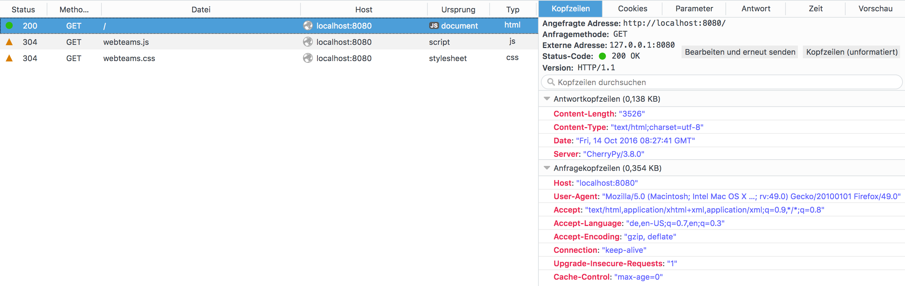
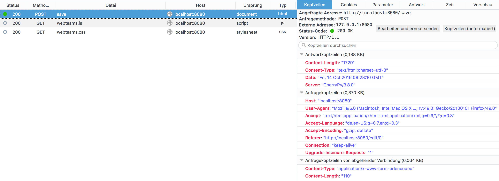

#0. Einleitung
Martin Pietrowski, Lukas Pajak Gruppe A
Gültig ab 01.11.16

#1. Aufbau der Webanwendung

##1.1 Varianten des Webclient

###1.1.1 Listenform
Die Listenform zeigt jedes Paar als eine Zeile bestehend aus jeweils für jeden Partner eigener Spalte für Vorname, Nachname, Martrikelnummer und Semester. Darüber hinaus befinden sich in jeder Zeile ein Button für das Löschen und Bearbeiten einer jeweiligen Zeile.

###1.1.2 Aufzählungsform
Eine leicht abgeänderte Darstellung bietet die Aufzählungsform, welche wie der Name schon impliziert werden die Studenten als Gruppen aufgezählt, auch hier lassen diese sich durch die Löschen- und Bearbeiten-Buttons modifizieren.

###1.1.3 Formular
Klickt man auf den Button Bearbeiten, hat man die Möglichkeit, die verschiedenen Attribute, welche in der Liste angezeigt werden (Ausnahme: Nr.) zu ändern. Die Aktion kann man anschließend Speichern oder abbrechen.

##1.2 Aufbau des Webservers
Als Schnittstelle wird CherryPy verwendet, wessen Engine der Webserver nach dem Start ausführt. Außerdem befindet sich auf dem Webserver:
*   view.py für die Darstellung der Seite mittels template-Dateien
*   application.py ist zuständig für die Funktionalität, wie Bearbeiten etc.
*   database.py verwaltet die Datenbank

#2. Durchgeführte Ergänzungen

##2.1 Dateneingabe des 2. Team-Mitglieds
Bei dieser Ergänzung wurden die Zeilen des ersten Team-Mitglieds dupliziert und statt der 1 in den Attributen wurde eine 2 gesetzt.

##2.2 Semesteranzahl
Wichtig bei dieser Ergänzung war, in jeder Operation welche explizit von einer bestimmten Menge Daten ausgegangen wird, diese mit 2 weiteren zu ergänzen. 

##2.3 Abbrechen-Aktion
Der Abbrechen-Button führt ohne zu speichern zur Hauptseite zurück.

##2.4 CSS
Für eine ansprechende Darstellung wurde mittels CSS Die Tabelle und das Formular gestaltet.

##2.5 Löschen-Funktion
###2.5.1 Funktion
Beim Löschen werden die Attribute mittels getDefault() ersetzt, welche ein Array mit leeren Strings zurückgibt.

###2.5.2 Rückfrage
Lehnt der Nutzer die Löschanfrage ab, wird das Event zur weiteren Ausführung gehindert.

##2.6 History-Funktion
Dadurch, dass die URL beim Darstellungswechsel der Listen modifiziert wird, kann der Browser die Änderungen nachvollziehen, was dazu führt, dass die Zustände gemerkt werden und so die Zurück-Funktion des Browser funktioniert.

#3. Beschreibung des HTTP-Datenverkehrs
##3.1 Start der Anwendung

Zuerst wird eine GET-Anfrage an den Server gesendet. Der Server antwortet mit einer generierten HTML-Seite. Aus dem HTML-Code und seinen Imports wird zusätzlich eine GET-Anfrage für die webteams.js und die webteams.css Datei an den Server gesendet, welche mit den angefragten Dateien antwortet.

##3.2 Speichern von Formulardaten

Nach dem Speichern, wird eine POST-Nachricht an den Server gesendet, welche die neuen Attribute beinhaltet. Der Server antwortet mit der neu generierten Seite und den geänderten Attributen, welche wie bei 3.1 dazu führen, dass für die .css und .js Datei eine GET-Anfrage gesendet wird.

